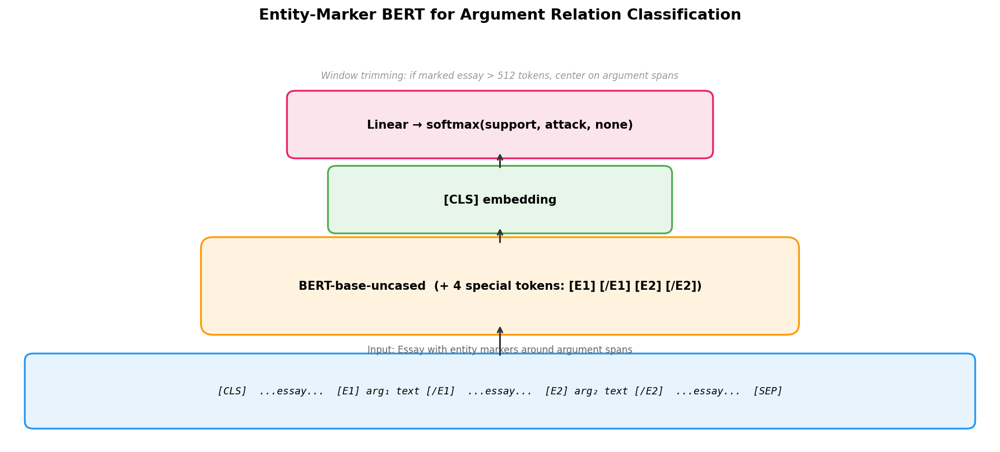
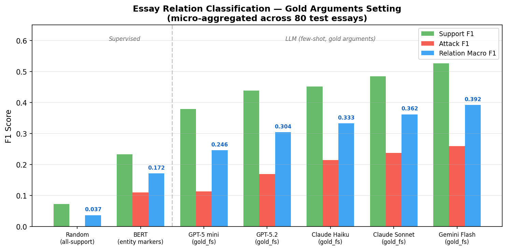
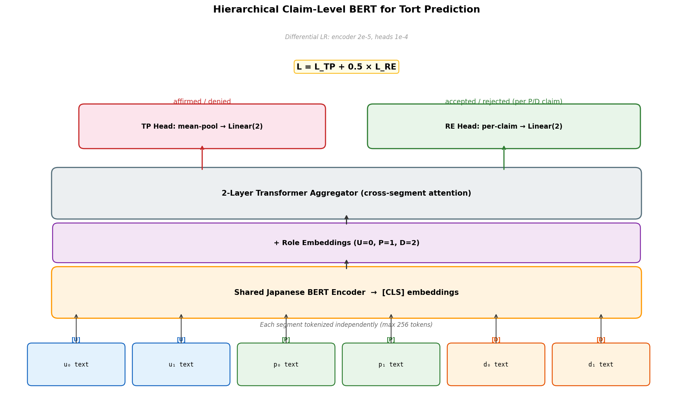
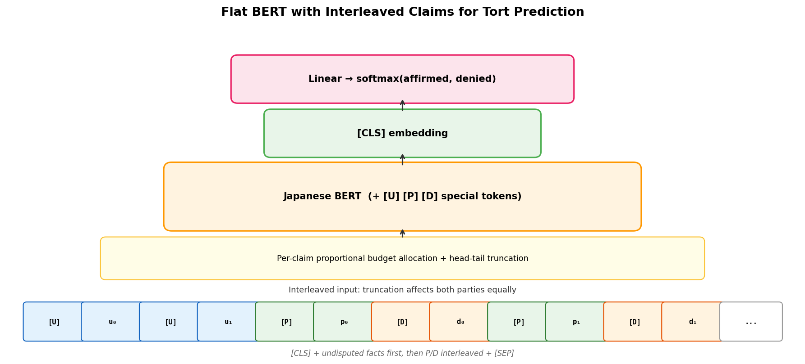
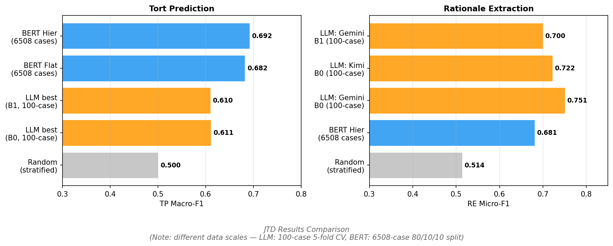

# Supervised BERT Baselines for Argumentation Tasks

## 1. Motivation

Our LLM-based experiments on two argumentation tasks — argument relation classification (Persuasive Essays) and tort prediction (JTD) — show that performance on these subtasks remains limited. To contextualize these results, we finetune BERT models as supervised baselines. The goal is twofold:

1. **Gauge the difficulty** of each subtask by measuring how well a model with direct access to labeled training data can perform.
2. **Identify the nature of the bottleneck**: if a supervised model with full training data still underperforms LLMs (which operate zero/few-shot), this indicates the task requires reasoning beyond statistical pattern matching.

## 2. Task 1: Essay Argument Relation Classification

### 2.1 Task Formulation

Given an essay and a pair of gold argument spans, classify the directed relation between them as **support**, **attack**, or **none**. This isolates relation classification from argument identification, matching the `gold_fs` / `gold_zs` conditions in our LLM experiments.

- **Dataset**: Persuasive Essays v2 (AAEC). 322 train / 80 test essays.
- **Training pairs**: All ordered pairs of gold arguments per essay, with none-class subsampling (ratio 3:1).
- **Class distribution (test)**: 96.0% none, 3.8% support, 0.2% attack — extreme imbalance.

### 2.2 Model Design: Entity-Marker BERT

A critical design insight emerged from our initial experiments: **argument position within the essay is a strong discriminative feature** (related pairs are 2.8x closer in character distance than unrelated pairs). A naive input format that places the essay in one segment and the arguments in another prevents BERT from exploiting this signal, since it cannot easily perform cross-segment substring matching.

We adopt the **entity-marker approach** from NLP relation extraction (Baldini Soares et al., 2019): arguments are marked in-place within the essay using special tokens `[E1]`/`[/E1]` and `[E2]`/`[/E2]`.



**Input format**:
```
[CLS] ...essay text... [E1] arg₁ text [/E1] ...essay text... [E2] arg₂ text [/E2] ...essay... [SEP]
```

**Key design choices**:
- **Window trimming**: When the marked essay exceeds 512 tokens, we trim to a window centered on the two argument spans, preserving the discourse context between them.
- **Inverse-frequency class weights**: Without class weighting, the model collapses to always predicting the majority class (none). An ablation (entity markers + no class weights) confirmed this: the model achieved 0.000 relation macro F1 across all 10 epochs.
- **Special tokens**: `[E1]`, `[/E1]`, `[E2]`, `[/E2]` are added to the vocabulary and BERT's embedding matrix is resized accordingly.

### 2.3 Results

**Metric**: Relation Macro F1 = mean(Support F1, Attack F1), micro-aggregated (pool TP/FP/FN across all 80 test essays, then compute per-type F1).

| Method | Support F1 | Attack F1 | **Rel Macro F1** |
|--------|------------|-----------|------------------|
| Random (always-support) | 0.073 | 0.000 | 0.037 |
| BERT (entity markers, no weights) | 0.000 | 0.000 | 0.000 |
| **BERT (entity markers, weighted)** | **0.233** | **0.110** | **0.172** |
| LLM: GPT-5 mini (gold_fs) | 0.379 | 0.113 | 0.246 |
| LLM: GPT-5.2 (gold_fs) | 0.439 | 0.169 | 0.304 |
| LLM: Claude Haiku 4.5 (gold_fs) | 0.452 | 0.214 | 0.333 |
| LLM: Claude Sonnet 4.5 (gold_fs) | 0.485 | 0.238 | 0.362 |
| LLM: Gemini 3 Flash (gold_fs) | 0.526 | 0.259 | **0.392** |



**Training dynamics**: The entity-marker BERT model trained properly — val macro F1 improved from 0.000 (epoch 1) to 0.226 (epoch 9), with attack F1 appearing from epoch 6 onwards. The model learned to use positional cues to discriminate related from unrelated pairs, but with limited precision (13.9% for support).

### 2.4 Discussion

The supervised BERT baseline (0.172) substantially outperforms random (0.037, 4.6x improvement), confirming that entity markers enable learning of positional and contextual features. However, **all LLMs outperform BERT by a wide margin** (best LLM: 0.392, 2.3x BERT).

This result is notable because BERT has a supervised advantage (282 labeled training essays) while LLMs operate with only 3 few-shot examples. The gap indicates that argument relation classification relies heavily on **semantic understanding of argumentation** — recognizing that "lack of adequate controls" supports "negative impacts" requires world knowledge about causal reasoning that BERT cannot acquire from ~10K training pairs.

The BERT result does **not** serve as a performance ceiling. Instead, it establishes a lower bound for what positional pattern matching alone can achieve, highlighting that the LLMs' advantage comes from genuine discourse reasoning.

---

## 3. Task 2: JTD Tort Prediction

### 3.1 Task Formulation

Given a Japanese tort case (undisputed facts, plaintiff claims, defendant claims), predict whether the tort is affirmed or denied (binary classification). As a multi-task objective, we also predict per-claim acceptance (rationale extraction, RE).

- **Dataset**: 6,508 cases. 39.5% affirmed, 60.5% denied.
- **Split**: Stratified 80/10/10 → 5,206 train / 651 val / 651 test.
- **Note**: LLM experiments used a 100-case subsample with 5-fold CV. The comparison is informative but not directly head-to-head due to different data scales.

### 3.2 Model Design A: Hierarchical Claim-Level BERT

The key challenge is that 42% of cases exceed BERT's 512-token limit when concatenated as flat text, systematically truncating defendant claims (which appear last). We address this with a hierarchical architecture that encodes each claim independently.



**Architecture**:
1. **Segment encoder**: `cl-tohoku/bert-base-japanese-v3` encodes each claim/fact independently (max 256 tokens). Only 2.1% of individual segments exceed this limit.
2. **Role embedding**: Learned embeddings for U/P/D roles, added to segment [CLS] vectors.
3. **Transformer aggregator**: 2-layer Transformer encoder with cross-segment attention.
4. **TP head**: Mean-pool all segment embeddings → Linear(2) for tort prediction.
5. **RE head**: Per-claim embeddings → Linear(2) for acceptance prediction.
6. **Multi-task loss**: L = L\_TP + 0.5 \times L\_RE.

**Key design choices**:
- **Differential learning rate**: Encoder at 2e-5, aggregator/heads at 1e-4.
- **Gradient accumulation** (8 steps) for effective batching across variable-length cases.
- **bf16 mixed precision** for memory efficiency.

### 3.3 Model Design B: Flat BERT with Interleaved Claims

As a simpler alternative, we use standard `BertForSequenceClassification` with a carefully designed input encoding to mitigate truncation bias.



**Truncation strategy**:
1. Undisputed facts placed first (background context).
2. Plaintiff and defendant claims **interleaved** (p₀, d₀, p₁, d₁, ...) so truncation affects both parties equally.
3. Role markers `[U]`, `[P]`, `[D]` as special tokens.
4. **Proportional per-claim budget** with **head-tail truncation**: each claim gets a fair share of the 512-token budget; both the beginning and end of each claim are preserved (important for legal text where conclusions often appear at the end).

### 3.4 Results

| Method | Data Setting | RE Micro-F1 | TP Accuracy | **TP Macro-F1** |
|--------|--------------|-------------|-------------|-----------------|
| Random (stratified) | — | 0.514 | 0.500 | 0.500 |
| LLM: Kimi K2.5 B0 | 100 cases, 5-fold | **0.722** | 0.618 | 0.611 |
| LLM: Gemini B1 | 100 cases, 5-fold | 0.700 | 0.627 | 0.610 |
| LLM: Kimi K2.5 B2 (Strat B) | 100 cases, 5-fold | 0.470 | 0.640 | 0.597 |
| **BERT Flat** | **6508 cases, split** | — | 0.704 | 0.682 |
| **BERT Hierarchical** | **6508 cases, split** | 0.681 | **0.707** | **0.692** |



**Training dynamics** (hierarchical): Loss decreased steadily from 1.01 to 0.20 over 9 epochs. Validation metrics improved smoothly to TP Macro-F1 = 0.72 before early stopping — proper convergence with no oscillation, in stark contrast to the unstable training observed with the earlier 100-case setup.

### 3.5 Discussion

**TP performance**: BERT with full training data (0.692 Macro-F1) outperforms the best LLM (0.611) by 8 points. However, this gap is expected given the ~50x data advantage (5,206 vs ~80 effective training cases per fold). The more informative comparison is the BERT ceiling against the inherent difficulty: at 0.692, there is meaningful room above random (0.500) but well below perfect, suggesting tort prediction from claim text alone is a fundamentally hard task.

**RE performance**: Notably, LLM B0 (Gemini, 0.751) outperforms the BERT RE head (0.681) despite the massive data disadvantage. This suggests that per-claim acceptance prediction benefits from LLMs' legal reasoning capabilities — understanding whether a legal argument is likely to be accepted by a court requires domain knowledge that supervised training on 5,206 cases does not fully capture.

**Hierarchical vs Flat**: Nearly identical TP performance (0.692 vs 0.682, \Delta = 0.010). The flat model's interleaved truncation strategy effectively mitigates the systematic defendant-truncation bias that motivated the hierarchical design. The hierarchical model's advantage is its ability to also produce RE predictions, making it a multi-task model.

**TP from RE** (hierarchical only): The TP-from-RE strategy (deriving tort prediction from aggregated claim-level predictions) achieves 0.667 Macro-F1, slightly below the direct TP head (0.692). The RE-to-TP consistency is 89.2%, indicating the two prediction paths largely agree.

---

## 4. Summary

| Task | Supervised BERT | Best LLM | Who wins? |
|------|----------------|----------|-----------|
| **Essay Relation Classification** | 0.172 | 0.392 (Gemini, gold\_fs) | LLM by 2.3x |
| **JTD Tort Prediction** | 0.692 | 0.611 (Kimi, B0) | BERT by 0.08* |
| **JTD Rationale Extraction** | 0.681 | 0.751 (Gemini, B0) | LLM by 0.07* |

\* Different data scales: BERT uses 6,508 cases; LLMs use 100-case subsample.

**Key insights**:

1. **Argument relation classification is not a pattern-matching task.** Even with entity markers that encode positional information and supervised training on 282 essays, BERT achieves less than half the performance of few-shot LLMs. This validates the premise of using LLM-based methods for argumentation framework construction — the task genuinely requires reasoning that goes beyond statistical associations.

2. **Tort prediction benefits from training data.** With sufficient labeled data, supervised methods outperform zero-shot LLMs on the binary prediction task. This suggests that scaling the LLM experiments to the full dataset (or incorporating few-shot retrieval from training cases) could improve LLM TP performance.

3. **Legal reasoning for RE remains an LLM strength.** Per-claim acceptance prediction appears to require understanding of legal merit and precedent that even 5,206 training cases cannot teach BERT. This is the most promising direction for AF-based methods that leverage LLMs' domain knowledge.
